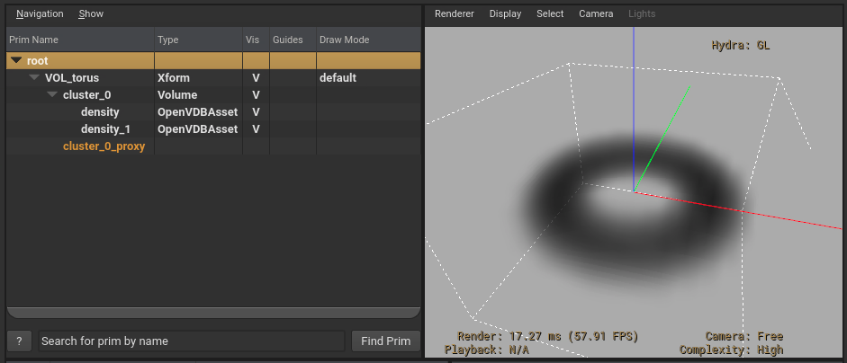

# Overview

The UsdVol schema domain contains schemas for working with volumes and
volumetric data. Volumes encapsulate fields of discretized volumetric data,
where the data can potentially be sparse or time-varying. Volumes can be used
to represent effects like smoke or fire.

The volumetric data referenced by Volumes can be contained in OpenVDB or Field3D
assets. UsdVol can also be extended to support other volume formats or sources.

The following screenshot shows a Volume with density fields that point to
OpenVDB assets.



(usdVol_working_with_volumes)=

## Working With Volumes

A Volume prim represents a renderable volume, such as a fog or fire effect.

Volumes contain volumetric data represented as relationships to prims that
have a FieldBase-derived schema applied. Each field relationship is specified
as a relationship with a namespace prefix of "field". The relationship names,
such as "density", are used by the renderer to associate individual fields with
the named input parameters on a volume shader.

For example, the following Volume defines a field relationship to an OpenVDB
asset. The field relationship name specifies that the OpenVDB asset contains
data that the renderer and volume shader should use for the density of the
volume. The Volume also has a material binding to a Material (not defined in
this example).

```{code-block} usda
def Volume "Volume" (
    prepend apiSchemas = ["MaterialBindingAPI"]
)
{
    custom rel field:density = </Volume/densityVDB>
    uniform token purpose = "render"
    double3 xformOp:scale = (1, 1, 1)
    double3 xformOp:translate = (0, -3, 0)
    token[] xformOpOrder = ["xformOp:translate", "xformOp:scale"]
    rel material:binding = </Materials/VolumeMaterial>    

    def OpenVDBAsset "densityVDB"
    {
        token fieldName = "density"
        asset filePath = @/vdbdata/smoke_plume.101.vdb@,
        }
    }
}

```

Volume additionally inherits from GPrim and inherits GPrim and Imageable
schema properties for rendering, and supports using primvars to bind data
to the USD Material/Shader pipeline during rendering. In the above example,
the bound material, :usda:`</Materials/VolumeMaterial>`, would have a volume
shader as a terminal node in the Material's shader network, and you would
provide primvars to bind Volume or GPrim data to that shader to control how
your Volume is rendered. Note that Hydra uses a fallback volume material if
your Volume doesn't have a material binding.

```{admonition} Volume Use Cases 
:class: note

Because Volume inherits from GPrim, it is primarily intended to
be used for renderable/imageable volumes. However, UsdVol Volume prims could
be used for "non-renderable" use cases such as encapsulating volumetric data 
used for simulations, depending on your workflow.
```

(usdVol_working_with_fields)=

## Working With Fields

UsdVol provides a several abstract schemas that other field schemas inherit
from, including FieldBase (the base schema class for all field schemas) and
FieldAsset (the base schema class for schemas that represent a field asset with
volumetric data stored outside the layer, e.g. in a file asset). In practice,
you'll use FieldAsset-derived schemas, such as OpenVDBAsset or Field3DAsset,
to work with volumetric data of a specific format.

### Making Fields Child Prims of Volumes

A general best practice is to make your Field prims children of the containing
Volume prim. This helps organize things in your USD scene, making the Fields
easy to find and reference. Also, the grid extracted from a Field prim is
positioned in world space by the local-to-world transformation of the Field
prim, plus, in the case of prims with Field-Asset derived schemas, any
transformation contained in the external asset encoding. By making
the Field prim a child of a Volume, re-positioning the Volume will automatically
move all its child Field prims along with it.

```{admonition} Using Fields in Multiple Volumes
:class: note

While it is recommended, it is not required to have Field prims be children of
Volume prims. If you have a use-case where need to use the same Field prim
for multiple Volumes, you may find it helpful organizationally to not have the
Field prim as a child of any Volume prim. 
```

(usdVol_using_animated_field_data)=

### Using Animated Field Data

Volumetric data is often animated. For Volumes with FieldAsset-derived Fields,
animation is represented by setting time samples on the filePath attribute.
The following example sets time samples in a OpenVDBAsset field to different
VDB assets:

```{code}
def Volume "wisp"
{
    float3[] extent = [(-57, -91, -44), (57, 31, -23)]

    rel field:density = </wisp/density>

    def OpenVDBAsset "density"
    {
        asset filePath.timeSamples = {
            101: @./wisp_01.101.vdb@,
            102: @./wisp_01.102.vdb@,
            103: @./wisp_01.103.vdb@,
            104: @./wisp_01.104.vdb@,
        }
        token fieldName = "density"
    }
}
```

(usdVol_understanding_fieldname)=

### Understanding `fieldName` and the Field's Relationship Name

FieldAsset-derived fields provide a `fieldName` attribute that is used to
identify the name of a field in the Field's asset. In an OpenVDB asset, this
might be the name of a grid in a VDB file. A Volume also provides a way to
specify the "name" for a field, via the
{ref}`relationships grouped inside the 'field' namespace <Volume>`, but
this name is not tied to the asset data. Instead, a Volume defines fields using
names appropriate for the Volume and/or rendering pipeline. Additionally, being
able to define a field name at the Volume level lets you re-use Field prims for
multiple volume fields if needed.

For example, you might have a situation where your Volume needs a "velocity"
field for the purposes of shader parameters, but you have an OpenVDB asset with
a grid named "vel". You would specify a `field:velocity` relationship in your
Volume prim to the OpenVDBAsset that references the desired VDB data with a
"vel" fieldName.
